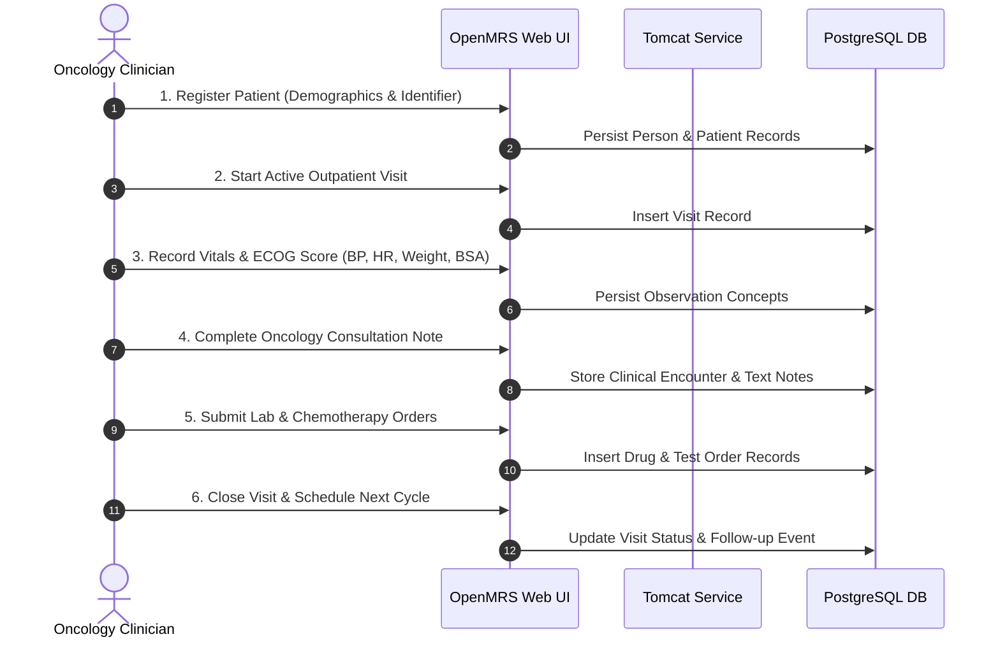

# OpenMRS GCP Pilot — Quality Assurance & Synthetic Test Plan

**Document Version:** 1.0.0  
**Target Environment:** Oncology Department Pilot Instance (GCP)  
**Data Compliance:** 100% Synthetic / Fictional Data (Zero Protected Health Information / PHI)

---

## 1. Overview & Objectives

The purpose of this document is to establish a rigorous, standardized testing protocol for the OpenMRS GCP pilot deployment. It ensures that the underlying PostgreSQL database, OpenMRS Reference Application, and NGINX proxy correctly execute clinical oncology workflows, maintain data integrity across restarts, and preserve audit logging.

### Key Objectives:
1. Validate end-to-end oncology outpatient workflows.
2. Provide a 50-patient synthetic dataset covering representative cancer types, stages, and regimens.
3. Test container lifecycle resilience, data persistence across restarts, and backup/restore integrity.

---

## 2. Synthetic Patient Cohort Specification (50 Patients)

The cohort below uses completely fictional identities, standardized phone numbers (`555-XXXX`), and realistic clinical scenarios across major oncology sub-disciplines.

### Cohort Distribution
* **Breast Oncology (12):** Early stage, locally advanced, and metastatic (ER+/PR+/HER2-, HER2+, TNBC).
* **Gastrointestinal Oncology (10):** Colorectal adenocarcinoma (Stages II–IV), gastric cancer.
* **Thoracic Oncology (10):** Non-Small Cell Lung Cancer (Adenocarcinoma, Squamous), Small Cell.
* **Genitourinary Oncology (8):** Prostate adenocarcinoma (Gleason 7–9), Urothelial bladder carcinoma.
* **Hematologic Malignancies (6):** Diffuse Large B-Cell Lymphoma (DLBCL), Multiple Myeloma.
* **Gynecologic & Other (4):** High-grade serous ovarian cancer, malignant melanoma.

---

### Patient Data Table (Sample & Specification)

| Patient ID | Name (Fictional) | Gender | DOB | Diagnosis & Stage | Biomarkers | ECOG | Planned Regimen / Orders |
|---|---|---|---|---|---|---|---|
| `ONC-SYN-001` | Elena Rostova | F | 1978-04-12 | Invasive Ductal Carcinoma (cT2N1M0, Stage IIB) | ER+ (90%), PR+ (70%), HER2- | 0 | Dose-Dense AC-T (Doxorubicin + Cyclophosphamide $\to$ Paclitaxel) |
| `ONC-SYN-002` | Marcus Vance | M | 1965-11-03 | Colon Adenocarcinoma (pT3N2aM0, Stage IIIB) | KRAS wild-type, MSI-Stable | 1 | mFOLFOX6 (Oxaliplatin + 5-FU + Leucovorin) x 12 cycles |
| `ONC-SYN-003` | Arthur Pendelton | M | 1959-08-22 | Lung Adenocarcinoma (cT3N2M1b, Stage IVA) | EGFR Exon 19 del, PD-L1 45% | 1 | Osimertinib 80mg daily oral therapy |
| `ONC-SYN-004` | Fatima Al-Mansoor | F | 1983-01-19 | Triple Negative Breast Cancer (cT2N0M0, Stage IIA) | ER- (0%), PR- (0%), HER2- (0) | 0 | Neoadjuvant Pembrolizumab + Carboplatin + Paclitaxel |
| `ONC-SYN-005` | David Chen | M | 1952-06-30 | Prostate Adenocarcinoma (cT3aN0M0, Gleason 4+4=8) | PSA 24.5 ng/mL | 1 | Androgen Deprivation Therapy (Leuprolide) + Radiation |
| `ONC-SYN-006` | Sofia Garcia | F | 1971-09-14 | Ovarian High-Grade Serous Carcinoma (Stage IIIC) | BRCA1 pathogenic variant | 1 | Carboplatin + Paclitaxel + Maintenance Olaparib |
| `ONC-SYN-007` | James O'Connor | M | 1968-03-27 | Diffuse Large B-Cell Lymphoma (Ann Arbor Stage III) | CD20+, IPI score 2 | 1 | R-CHOP x 6 cycles (Rituximab, Cyclo, Dox, Vincristine, Pred) |
| `ONC-SYN-008` | Priya Patel | F | 1989-12-05 | Hodgkin Lymphoma (Nodular Sclerosis, Stage IIA) | CD30+, CD15+ | 0 | ABVD (Doxorubicin, Bleomycin, Vinblastine, Dacarbazine) |
| `ONC-SYN-009` | Robert Lewandowski | M | 1960-07-18 | Rectal Adenocarcinoma (cT3N1M0, Stage III) | CEA 12.8 ng/mL, MSS | 1 | Total Neoadjuvant Therapy (TNT): FOLFIRINOX $\to$ Chemoradiation |
| `ONC-SYN-010` | Aisha Morales | F | 1975-02-28 | HER2+ Breast Carcinoma (cT2N1M0, Stage IIB) | ER+ (40%), HER2 (3+ IHC) | 0 | TCHP (Docetaxel, Carboplatin, Trastuzumab, Pertuzumab) |
| `ONC-SYN-011` | Thomas Wright | M | 1955-10-10 | Squamous Cell Lung Carcinoma (cT4N0M0, Stage IIIA) | PD-L1 80% | 1 | Pembrolizumab + Carboplatin + Paclitaxel |
| `ONC-SYN-012` | Linda Nguyen | F | 1964-05-16 | Multiple Myeloma (ISS Stage II) | IgG Kappa, Del 17p- | 1 | VRd (Bortezomib, Lenalidomide, Dexamethasone) |
| `ONC-SYN-013` | Samuel Jackson | M | 1970-11-20 | Bladder Urothelial Carcinoma (cT2bN0M0) | GFR 75 mL/min | 0 | Gemcitabine + Cisplatin neoadjuvant |
| `ONC-SYN-014` | Beatrice Miller | F | 1958-04-03 | Metastatic Colorectal Cancer (Stage IV to liver) | BRAF V600E mutant | 2 | Encorafenib + Cetuximab + FOLFIRI |
| `ONC-SYN-015` | Gregory Hayes | M | 1962-09-09 | Cutaneous Malignant Melanoma (Breslow 4.2mm, IV) | BRAF V600E mutant | 1 | Dabrafenib + Trametinib |
| `ONC-SYN-016` to `ONC-SYN-050` | Synthetic Cohort Cont. | M/F | 1950–1995 | Diverse staging & solid tumor subspecialties | Diverse standard panels | 0–2 | Standard NCCN-aligned chemotherapy & targeted protocols |

---

## 3. Clinical Workflow Test Sequence

The following 6-step clinical sequence must be performed and validated on the pilot deployment:



### Step-by-Step Test Procedure:

1. **Step 1: Patient Registration**
   * Action: Navigate to *Register a Patient*.
   * Inputs: Name, Gender, Birthdate, Synthetic Address, Identifier (`ONC-SYN-XXX`).
   * Pass Criteria: Patient dashboard displays newly assigned identifier and correct calculated age.

2. **Step 2: Active Visit Start**
   * Action: Click *Start Visit* $\to$ *Oncology Outpatient Clinic*.
   * Pass Criteria: Active visit banner appears in real-time.

3. **Step 3: Vitals & Body Surface Area (BSA) Capture**
   * Action: Open *Capture Vitals* form.
   * Inputs:
     * Blood Pressure: `124/78 mmHg`
     * Heart Rate: `72 bpm`
     * Temperature: `36.8 °C`
     * Weight: `68.5 kg`, Height: `172 cm` (Calculate BSA $\approx 1.81\text{ m}^2$)
     * ECOG Performance Status: `0`
   * Pass Criteria: Vitals graphs and summary table render values accurately.

4. **Step 4: Oncology Consultation Notes**
   * Action: Add *Clinical Note*.
   * Content: Oncologic history, staging summary, toxicity review, and treatment plan.
   * Pass Criteria: Note is saved and timestamped under encounters.

5. **Step 5: Medication & Lab Orders**
   * Action: Place orders for CBC, Comprehensive Metabolic Panel, and Chemotherapy Infusion.
   * Pass Criteria: Active orders appear under the patient's Orders tab.

6. **Step 6: Visit Closure**
   * Action: Click *End Visit*.
   * Pass Criteria: Visit moves to past visit history without data loss.

---

## 4. Infrastructure Resilience & Disaster Recovery Verification

### Test 4.1: Container Restart Persistence Test
* **Objective:** Ensure data is safely persisted in the named Docker volume `openmrs-db-data`.
* **Execution:**
  ```bash
  # 1. Stop and remove running containers
  docker compose -f docker/docker-compose.yml down

  # 2. Start containers again
  docker compose -f docker/docker-compose.yml up -d

  # 3. Query OpenMRS database for test patient records
  docker exec openmrs-db psql -U openmrs_user -d openmrs -c "SELECT count(*) FROM patient_identifier;"
  ```
* **Pass Criteria:** Record count remains identical before and after container destruction.

### Test 4.2: Backup & Restore Integrity Test
* **Objective:** Verify `scripts/backup-db.sh` and `scripts/restore-db.sh`.
* **Execution:**
  1. Trigger `./scripts/backup-db.sh`.
  2. Verify `.dump` and `.dump.enc` generated with non-zero size in `/var/backups/openmrs`.
  3. Execute `./scripts/restore-db.sh <dump_path>` on a test database instance.
* **Pass Criteria:** Zero table loss; all synthetic encounters remain intact.

---

## 5. QA Sign-Off Checklist

- [ ] All 50 synthetic patient records documented and verified free of real PII.
- [ ] 6-step clinical workflow executed successfully via browser.
- [ ] Postgres container restart persistence validated.
- [ ] Automated backup dump and AES-256 encryption verified.
- [ ] NGINX proxy headers and SSL parameters confirmed.
